# 🌐 Client-Server Architecture

## Overview

This document describes how the CUP Voting System could be transformed from a client-only application to a full client-server architecture.

## 📋 API Specification

See [openapi.yaml](openapi.yaml) for the complete REST API specification.

You can view the API documentation using:
- **Swagger UI**: https://editor.swagger.io (paste the YAML content)
- **Redoc**: https://redocly.github.io/redoc/
- **VS Code Extension**: OpenAPI (Swagger) Editor

## 🏗️ Architecture Overview

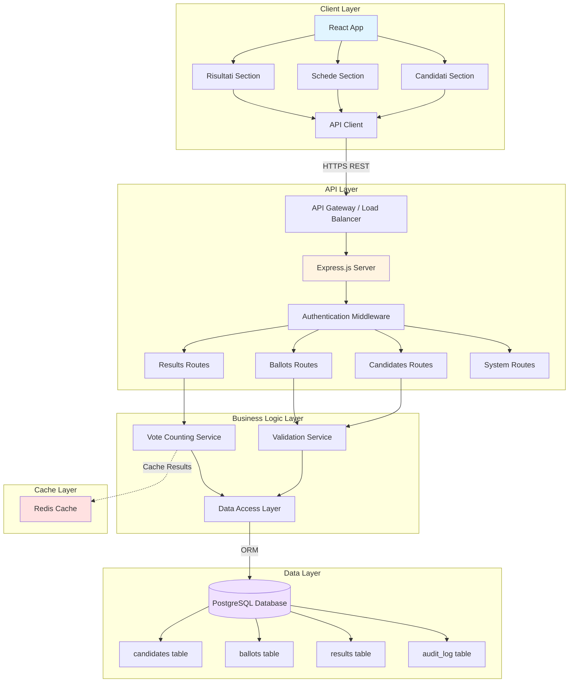

## 🔄 Request Flow Diagram

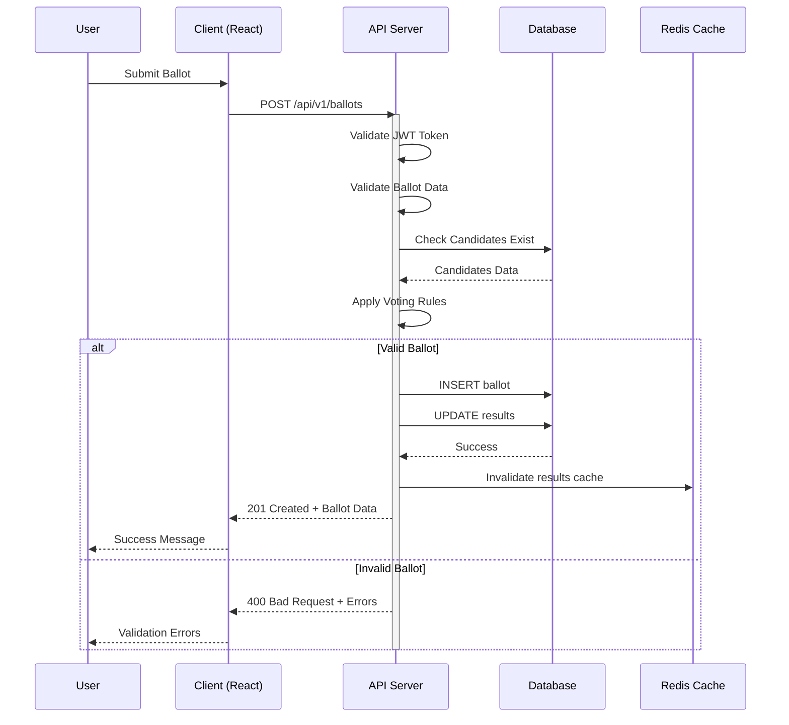

## 🗄️ Database Schema (ER Diagram)

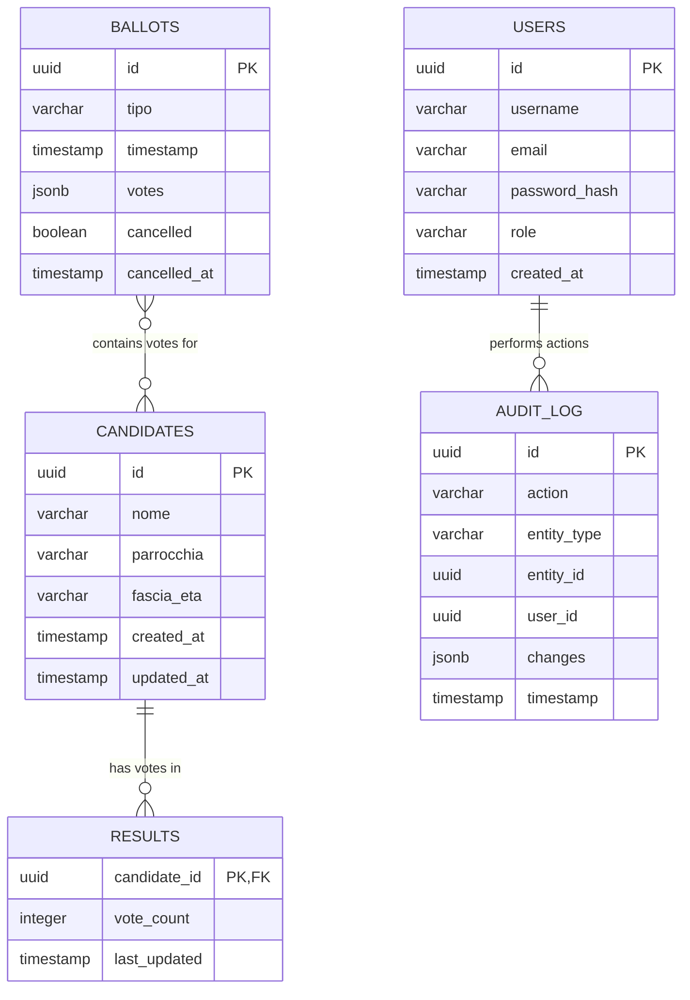

## 🔌 API Endpoints Map

```mermaid
mindmap
  root((CUP API))
    Candidates
      GET /candidates
      POST /candidates
      GET /candidates/{id}
      PUT /candidates/{id}
      DELETE /candidates/{id}
    Ballots
      GET /ballots
      POST /ballots
      GET /ballots/{id}
      DELETE /ballots/{id}
      POST /ballots/validate
      GET /ballots/summary
    Results
      GET /results
      GET /results/export
    System
      GET /system/config
      GET /system/health
      POST /system/reset
    Auth
      POST /auth/login
      POST /auth/logout
      GET /auth/me
```

## 🔐 Authentication Flow

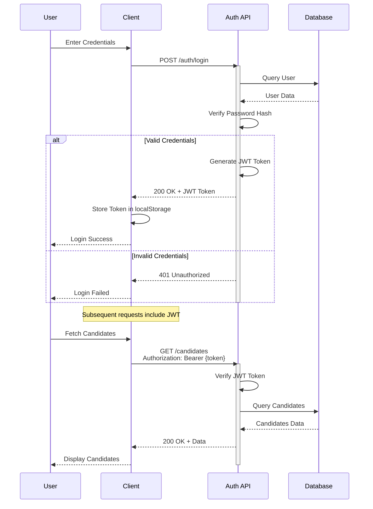

## 🏛️ System Architecture Layers

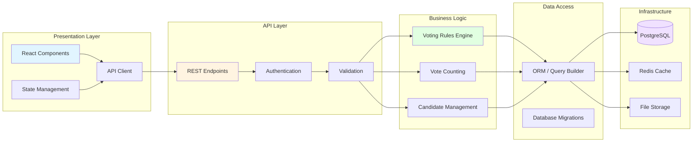

## 📊 Data Flow for Ballot Registration

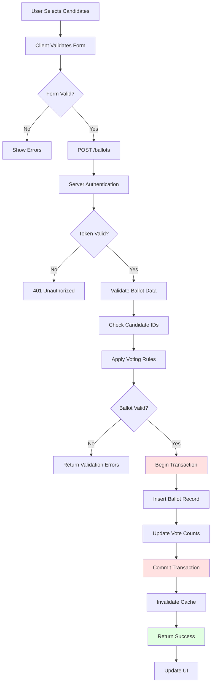

## 🔄 State Management Architecture

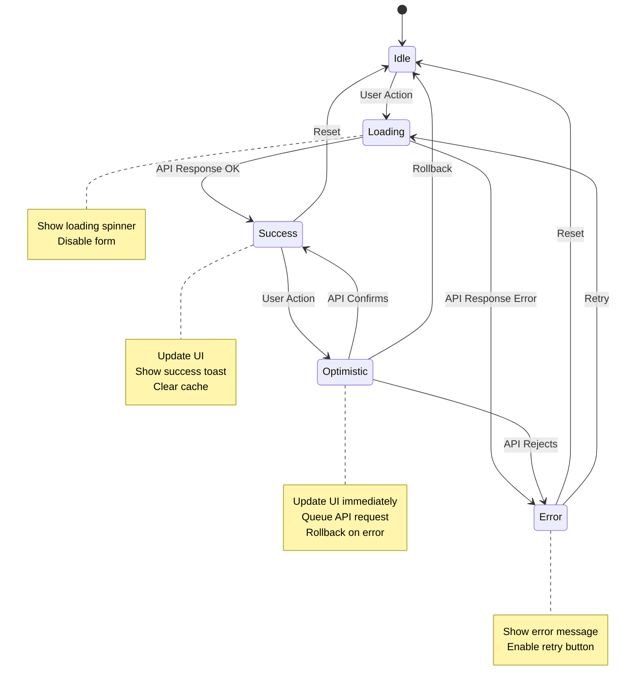

## 🚀 Deployment Architecture

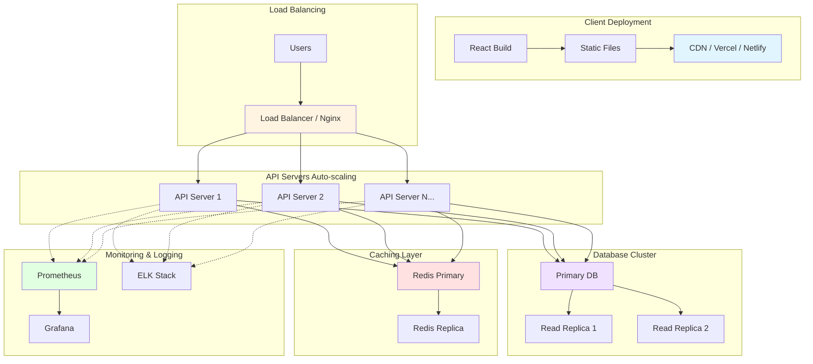

## 📦 Technology Stack

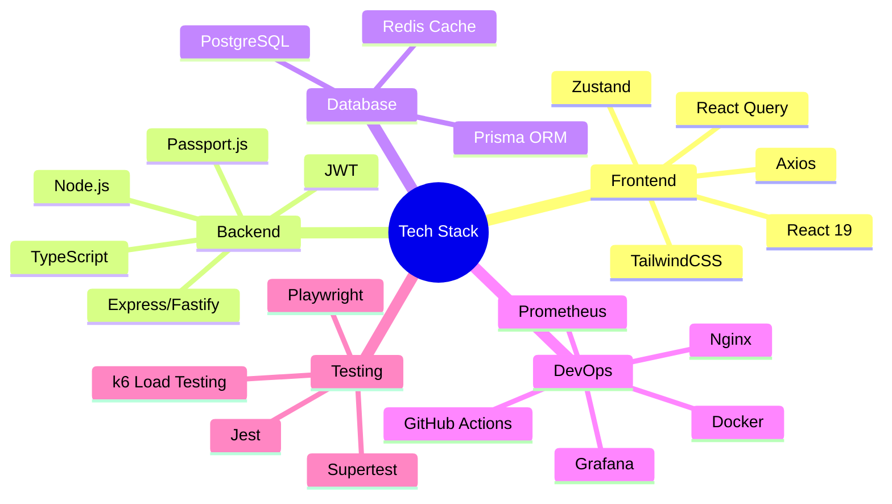

## 🔐 Security Layers

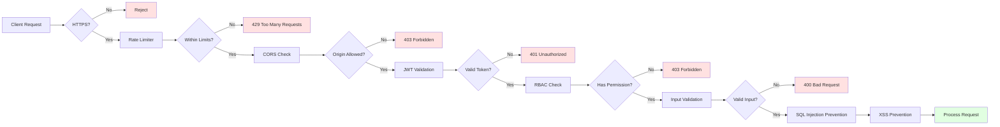

## 📈 Performance Optimization Strategy

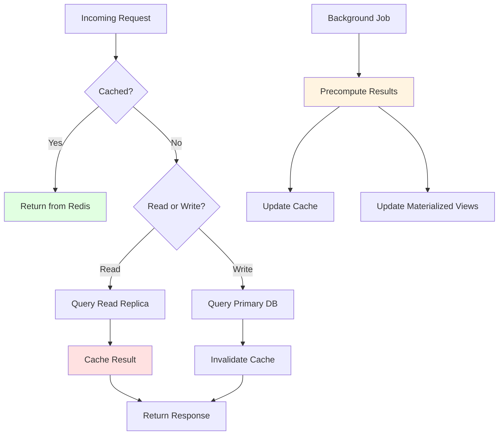

## 🧪 Testing Strategy

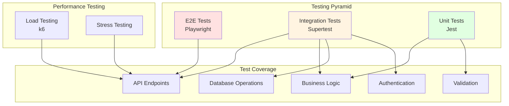

## 🎯 Migration Phases

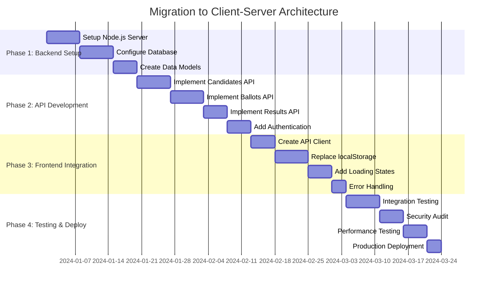

---

## 📝 Quick Start Example

### API Client Setup (React)

```javascript
// src/services/api.js
import axios from 'axios';

const api = axios.create({
  baseURL: process.env.REACT_APP_API_URL || 'http://localhost:3000/api/v1',
  headers: { 'Content-Type': 'application/json' }
});

// Add auth token
api.interceptors.request.use(config => {
  const token = localStorage.getItem('authToken');
  if (token) config.headers.Authorization = `Bearer ${token}`;
  return config;
});

export const candidatesApi = {
  getAll: (params) => api.get('/candidates', { params }),
  create: (data) => api.post('/candidates', data),
  delete: (id) => api.delete(`/candidates/${id}`)
};
```

### Using React Query

```javascript
// src/hooks/useCandidates.js
import { useQuery, useMutation, useQueryClient } from '@tanstack/react-query';
import { candidatesApi } from '../services/api';

export const useCandidates = () => {
  const queryClient = useQueryClient();

  const { data, isLoading, error } = useQuery({
    queryKey: ['candidates'],
    queryFn: () => candidatesApi.getAll()
  });

  const createMutation = useMutation({
    mutationFn: candidatesApi.create,
    onSuccess: () => {
      queryClient.invalidateQueries({ queryKey: ['candidates'] });
    }
  });

  return {
    candidates: data?.data?.data || [],
    isLoading,
    error,
    createCandidate: createMutation.mutate
  };
};
```

---

**Complete API specification available in [openapi.yaml](openapi.yaml)** 🚀
